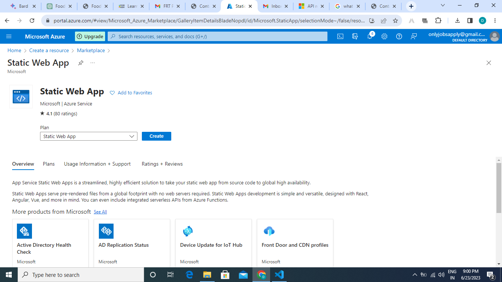

# Future Ready Talent Project Food Blog Website - By Dhruv Tomar

**The Food Blogger website is a platform dedicated to sharing culinary adventures, delicious recipes, and food-related articles. It aims to inspire and encourage visitors to explore the world of flavors, try new recipes, and enhance their culinary skills. With a focus on creating mouthwatering meals that delight the taste buds, the website provides a variety of resources for both seasoned chefs and beginners in the kitchen.**

## Problem Statement:-

**The Food Blogger website solves the problem of finding reliable and inspiring culinary resources in one convenient platform. It addresses the challenges faced by individuals who are passionate about cooking and seeking new recipes, cooking tips, and food-related content. By providing a wide range of high-quality recipes, informative articles, and engaging blog posts, the website serves as a go-to resource for food enthusiasts, helping them overcome the difficulties of finding reliable culinary inspiration and guidance. Whether users are looking for new recipes to try, seeking cooking tips and techniques, or simply wanting to immerse themselves in the world of food and flavors, the Food Blogger website offers a solution by curating and presenting valuable culinary content in an accessible and user-friendly manner.**

## Azure services used:

#### Static Web App
#### Azure CDN

**Static Web App**

Azure Static Web Apps is a fully managed service that allows you to deploy and host static web apps on Azure. It is a serverless service, which means that you do not need to manage any servers or infrastructure. Azure Static Web Apps also provides global distribution, so your web app will be available to users all over the world.

**Azure CDN**

Azure CDN is a content delivery network (CDN) service that delivers static content, such as images and JavaScript files, to users from the nearest point of presence (PoP). This can help to improve the performance of your website for users all over the world.

#### Website Structure

**It contains following files**
Index.html(Homepage)
blog.html
contact us.html
recipes.html
aboutus.html
Assets (Directory)

**Microsoft azure Url:-**
**Github pages Url:-**